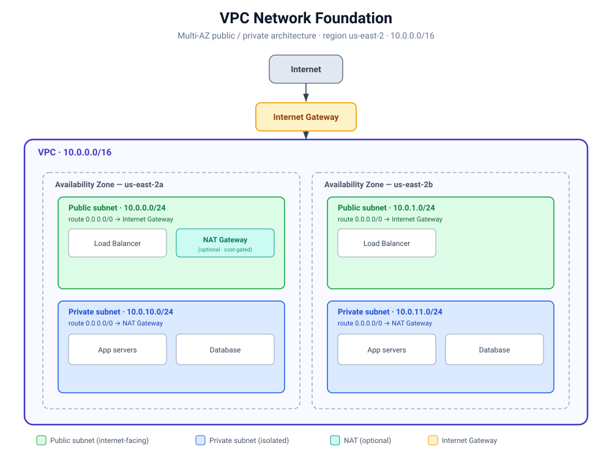

# Project 1 — VPC Network Foundation (CloudFormation)

A production-grade, cost-aware AWS network built with AWS CloudFormation: a multi-AZ VPC with public and private subnets, internet and (optional) NAT routing, and cross-stack exports so later stacks can build on top of it.



## What this builds

| Layer | Resources |
|-------|-----------|
| Network boundary | VPC (`10.0.0.0/16`), DNS enabled |
| Internet edge | Internet Gateway + VPC attachment |
| Public tier (2 AZs) | 2 public subnets (`10.0.0.0/24`, `10.0.1.0/24`), auto-assign public IPs |
| Private tier (2 AZs) | 2 private subnets (`10.0.10.0/24`, `10.0.11.0/24`), isolated |
| Routing | Public route table (0.0.0.0/0 → IGW) + associations; private route table + associations |
| Outbound (optional) | Elastic IP + NAT Gateway + private default route — created only when enabled |
| Interface | Outputs/Exports for VPC ID and all subnet IDs |

## Design decisions

- **Two Availability Zones.** Every tier spans `us-east-2a` and `us-east-2b` so the network survives the loss of a single AZ. AZs are chosen dynamically with `!Select [n, !GetAZs '']`, keeping the template region-portable.
- **Public / private split.** Public subnets hold internet-facing resources (load balancers, NAT); private subnets hold app servers and databases with no inbound path from the internet — the core cloud security pattern.
- **Cost-gated NAT.** A NAT Gateway (~$32/mo) is the only billable resource, so it sits behind a `Condition` and is **off by default**. Enable it only when private outbound access is needed:
  ```bash
  aws cloudformation deploy --template-file vpc.yaml --stack-name vpc-foundation \
    --parameter-overrides EnableNatGateway=true
  ```
- **Cross-stack exports.** VPC and subnet IDs are exported under stable, environment-prefixed names so downstream stacks import them (`!ImportValue dev-vpc-id`) instead of hardcoding IDs.
- **Consistent tagging.** Every resource carries an environment-prefixed `Name` tag.

## Parameters

| Parameter | Default | Purpose |
|-----------|---------|---------|
| `EnvironmentName` | `dev` | Prefix for names / tags / export names |
| `VpcCIDR` | `10.0.0.0/16` | VPC address range |
| `PublicSubnet1CIDR` / `PublicSubnet2CIDR` | `10.0.0.0/24` / `10.0.1.0/24` | Public subnet ranges |
| `PrivateSubnet1CIDR` / `PrivateSubnet2CIDR` | `10.0.10.0/24` / `10.0.11.0/24` | Private subnet ranges |
| `EnableNatGateway` | `false` | Create the NAT Gateway (incurs cost) |

## Deploy

```bash
# validate first
cfn-lint --template vpc.yaml

# deploy (NAT off, free)
aws cloudformation deploy --template-file vpc.yaml --stack-name vpc-foundation
```

## Outputs (exports)

`dev-vpc-id`, `dev-public-subnet-1-id`, `dev-public-subnet-2-id`, `dev-private-subnet-1-id`, `dev-private-subnet-2-id`, plus comma-joined lists `dev-public-subnets` and `dev-private-subnets`.

## Cost

Free as deployed (VPC, subnets, gateways, and routing carry no charge). The only billable resource is the NAT Gateway, which is disabled by default. Tear down at any time:

```bash
aws cloudformation delete-stack --stack-name vpc-foundation
```

## Skills demonstrated

Networking fundamentals (CIDR, subnets, routing, AZs) · parameterization · conditional / cost-aware design · cross-stack composition · consistent tagging · linted, reproducible IaC.
