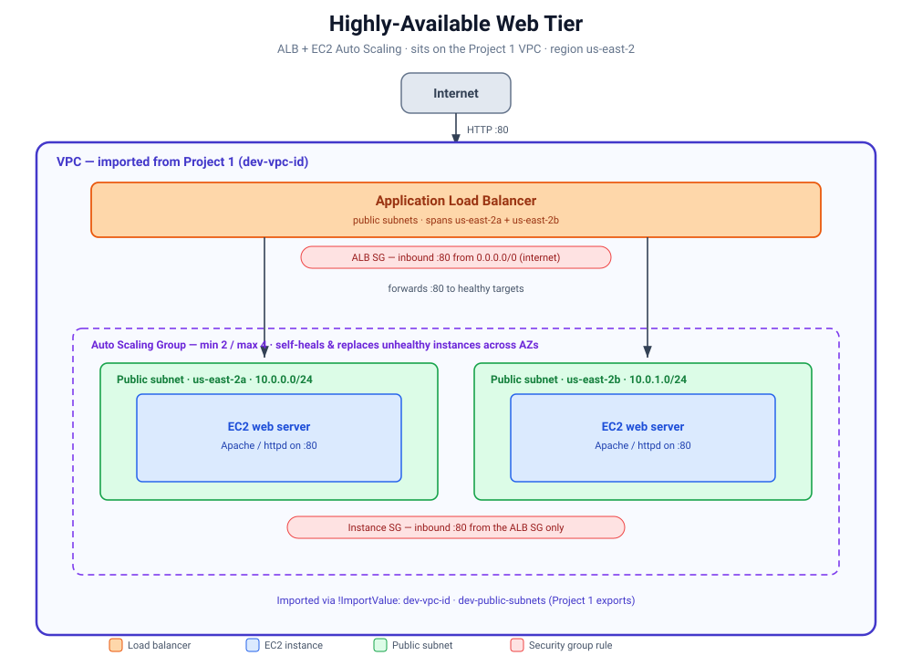

# Project 2 — Highly-Available Web Tier (CloudFormation)

An internet-facing web tier deployed on top of the Project 1 VPC: an Application Load Balancer spreading traffic across a self-healing EC2 Auto Scaling group in two Availability Zones.

## Architecture



Internet → **ALB** (public subnets) → **Target Group** → **EC2 Auto Scaling group** (2 AZs). This is a **separate stack** that imports the VPC and public subnets from the `vpc-foundation` stack via `!ImportValue`.

## What it demonstrates

- **Cross-stack imports** (`!ImportValue`) — the app tier plugs into the network stack without touching it
- Application Load Balancer, target group, listener
- **EC2 Launch Template + Auto Scaling group** (min 2 / max 4), self-healing across AZs
- **Least-privilege security groups** — the ALB is open to the internet on `:80`; the instances are reachable **only** from the ALB's security group
- Latest Amazon Linux 2023 AMI resolved dynamically via **SSM** (no hardcoded AMI)
- **User-data** bootstraps Apache + a page on first boot

## Deploy

```bash
aws cloudformation deploy --template-file web-app.yaml --stack-name web-app
aws cloudformation describe-stacks --stack-name web-app \
  --query "Stacks[0].Outputs" --output table
```

Open the `LoadBalancerURL` output in a browser. Expect a `503` for the first ~2-3 min while instances boot and pass health checks, then the page serves.

## Teardown

```bash
aws cloudformation delete-stack --stack-name web-app
```

## Notes

- The `vpc-foundation` stack (Project 1) must be deployed first — this stack imports its exports.
- Instances run in **public subnets** (security-group-locked to the ALB) to avoid NAT cost for a learning build. A production variant would place them in **private** subnets behind a NAT gateway.
- Costs while running: ALB (~$0.0225/hr) + 2x `t3.micro`. Tear down when done.
