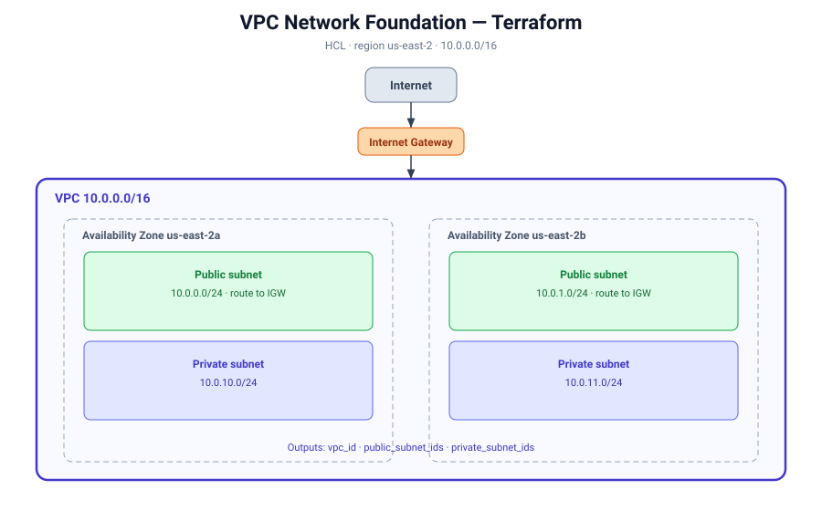

# Terraform — VPC Network Foundation (flat)

The Project 1 VPC, rebuilt in **Terraform (HCL)**. Same production network — VPC, internet gateway, two public + two private subnets across two AZs, and public routing — expressed as Terraform resources with input variables and outputs.

## Architecture



## What it demonstrates

- Terraform **providers** + `required_providers`
- **Resources** and references (`aws_vpc.main.id`), tags
- **Input variables** (`variables.tf`) with types and defaults
- **Outputs**
- The full workflow: `init -> plan -> apply -> destroy`
- **Local state** (see `../02-vpc-module` for the S3 remote-state version)

## Usage

```bash
terraform init
terraform plan
terraform apply     # type yes
terraform destroy   # type yes, when done
```

## Notes

- Region and all CIDRs are variables — change them in one place.
- This is the "flat" version (all resources in one file). The `02-vpc-module` project refactors it into a **reusable module**.
