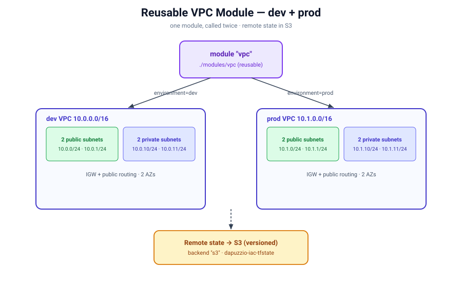

# Terraform — Reusable VPC Module + Remote State

The VPC foundation refactored into a reusable **module**, called twice to stand up two independent environments (**dev** + **prod**) from one tested building block. State is stored **remotely in a versioned S3 bucket**.

## Architecture



## Structure

```
02-vpc-module/
├── main.tf          # root: S3 backend + two module calls (dev, prod)
├── variables.tf     # root inputs
├── outputs.tf       # re-exposes module outputs
└── modules/
    └── vpc/         # the reusable VPC module
        ├── main.tf
        ├── variables.tf
        └── outputs.tf
```

## What it demonstrates

- **Modules** — a reusable VPC package: `source`, inputs/outputs, `module.<name>.<output>`
- **Multi-environment** — one module, two calls (`dev` = `10.0.0.0/16`, `prod` = `10.1.0.0/16`)
- **Remote state** — a `backend "s3"` block storing state in a **versioned S3 bucket** (safe, shareable, team-ready)

## Usage

```bash
terraform init      # registers the module + configures the S3 backend
terraform plan
terraform apply     # builds both dev and prod VPCs
terraform destroy   # when done
```

## Notes

- Backend bucket: `dapuzzio-iac-tfstate` (versioning enabled), key `vpc-module/terraform.tfstate`.
- State is **never** committed to git (`*.tfstate` is gitignored) — it lives only in S3.
